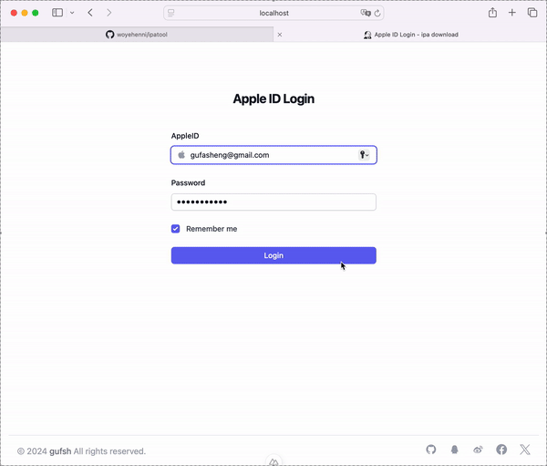
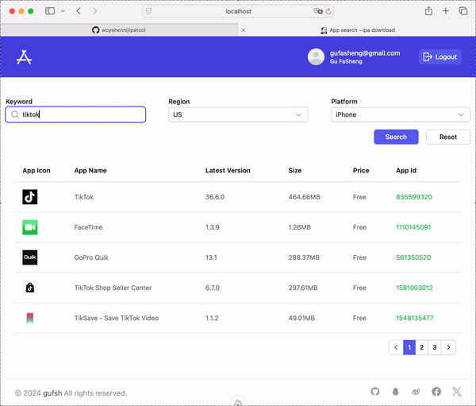
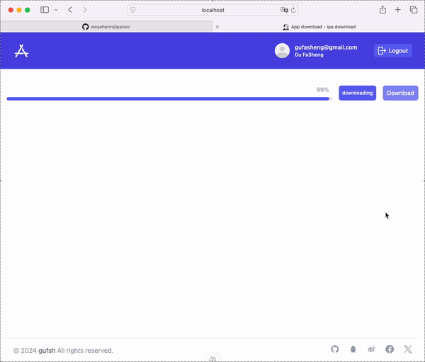

# ipatool web

`ipatool web` is a web UI that allows you to search and download the old version iPhone/Ipad apps on the App Store.

Code reference: [beer-psi/ipatool.ts](https://github.com/beer-psi/ipatool.ts)

## Demo

### Login


### Search old version


### Download


## Setup

Make sure to install the dependencies:

```bash
# npm
npm install

# pnpm
pnpm install

# yarn
yarn install

# bun
bun install
```

## Development Server

Start the development server on `http://localhost:3000`:

```bash
# npm
npm run dev

# pnpm
pnpm run dev

# yarn
yarn dev

# bun
bun run dev
```

## TODO

### purchase